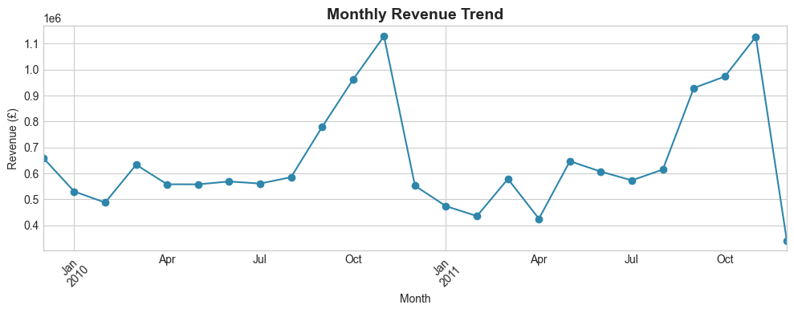
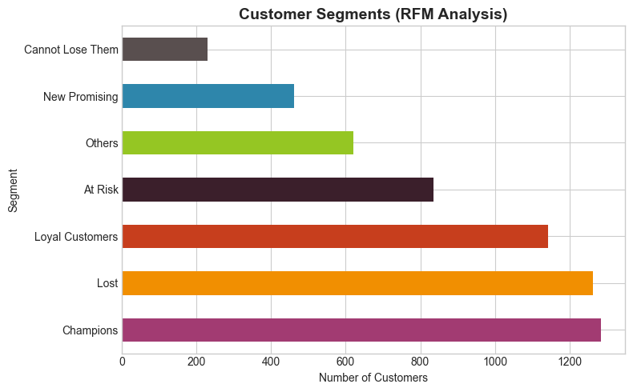
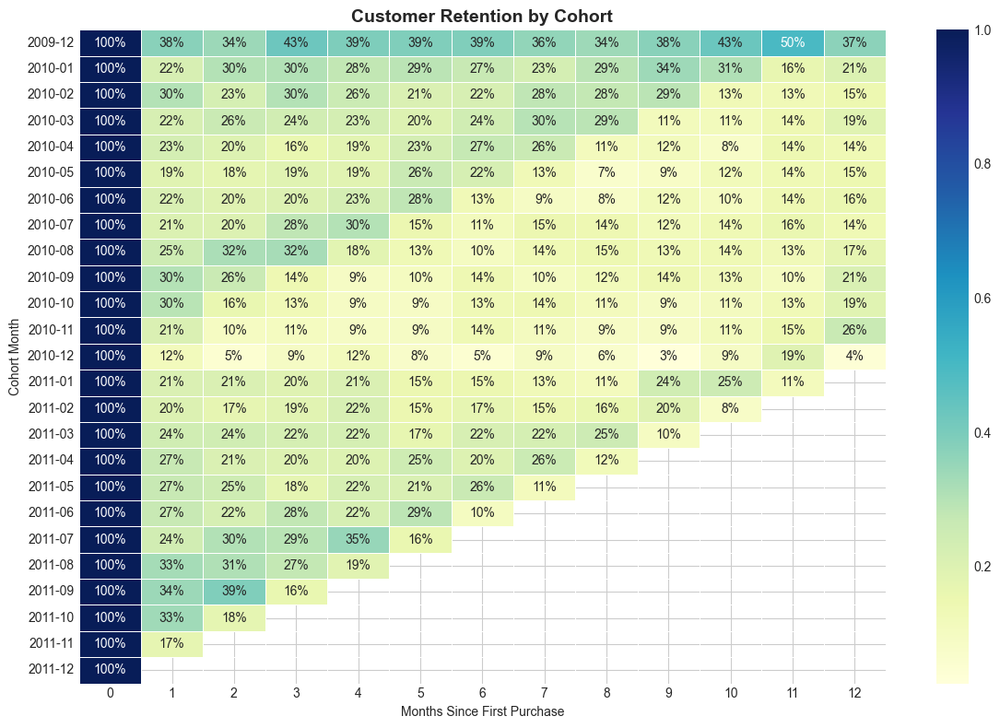
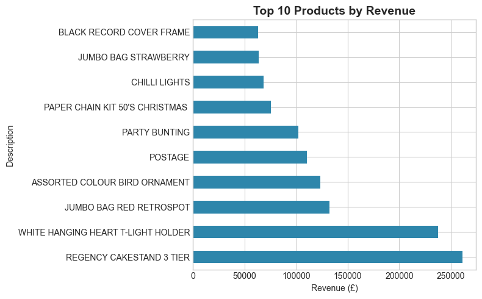

# E-Commerce Customer Intelligence: RFM and Cohort Analysis

## Executive Summary

This project analyzes 1.07 million transactions from a UK based online gift retailer to answer a core commercial question: which customers matter most, and which ones are at risk of leaving. Using RFM scoring (Recency, Frequency, Monetary value), the analysis segments 5,839 customers into seven business friendly groups, then uses cohort analysis to measure how well the retailer retains customers after their first purchase. The output is a segment level customer list, a set of visual summaries, and a short list of business recommendations. This kind of analysis matters because acquiring a new customer is more expensive than keeping one, and most businesses cannot tell, without this kind of scoring, which customers are quietly becoming inactive until it is too late to win them back.

## Business Problem and Objectives

The analysis was built to answer five business questions:

- Which customers generate the most value?
- Which customers are at risk of becoming inactive?
- How does retention vary across customer cohorts?
- Which customer segments should receive retention attention?
- Which products contribute most to revenue?

## Dataset

  - **Source:** UCI Machine Learning Repository, Online Retail II ([link](https://archive.ics.uci.edu/dataset/502/online+retail+ii))
  - **Records:** 1,067,371 raw transaction rows
  - **Time period:** December 2009 to December 2011, two sheets (Year 2009-2010 and Year 2010-2011) combined into one timeline
  - **Geography:** UK based online gift retailer, international customer base
  - **Entities:** Invoices, products, customers, quantities, unit prices
  - **Caveats:** Transaction level data only, no demographic or marketing channel data, so segmentation is based purely on purchase behavior

  ## Tools and Technologies

  Python, pandas, NumPy, matplotlib, seaborn, Jupyter Notebook.

  ## Data Preparation

  Each cleaning step was chosen for a specific analytical reason, not just to tidy the data:

  - **Removed rows with a missing customer ID.** A transaction that cannot be tied to a customer is unusable for any customer level analysis, including RFM and cohort work.
  - **Removed missing product descriptions and exact duplicate rows.** Prevents double counting the same transaction and keeps product level summaries accurate.
  - **Removed rows with both zero quantity and zero price.** These are non-transactional log entries (for example, price adjustments), not real purchases, and would distort revenue and frequency counts.
  - **Built a Revenue column (Quantity multiplied by Price).** Raw quantity and price fields have no business meaning on their own; Revenue is the metric the rest of the analysis is built on.
  - **Converted dates to a monthly period.** Business stakeholders think in months, not timestamps, and monthly periods are what the cohort analysis groups on.

  Result: 797,885 clean rows across 5,942 unique customers, down from 1,067,371 raw rows (25.2 percent removed as guest checkouts, duplicates, or non-transactional rows).

  ## Analysis and Methodology

  **RFM scoring.** Every customer is scored on three dimensions: Recency (days since their last purchase), Frequency (number of distinct orders), and Monetary value (total amount spent). Each dimension is split into five equal sized groups (quintiles), so a customer is ranked relative to every other customer, not against a fixed target. Recency is scored in reverse, since a lower number of days since the last purchase is a better outcome.

  **Customer segmentation.** The three scores are combined into one of seven named segments, for example Champions (high on all three) or At Risk (recent scores are low but the customer has a real purchase history). Naming the segments turns a set of numeric scores into categories a business owner can act on directly.

  **Cohort assignment and retention analysis.** Every customer is tagged with the month of their first ever purchase, forming a cohort. Each cohort is then tracked forward, month by month, to measure what percentage of that original group is still buying. This produces a retention curve per cohort rather than a single retention number, showing how customer loyalty holds up over time.

  ## Key Findings

  **Finding:** 5,839 of 5,942 cleaned customers received a named RFM segment. 103 customers were excluded because their net lifetime spend, after returns, was zero or negative.
  **Interpretation:** A small share of the customer base (1.7 percent) cannot be meaningfully scored on value because returns fully offset their purchases.
  **Business implication:** These customers should be reviewed separately from the main segmentation, as they may represent return abuse, sampling behavior, or data entry issues rather than typical low value customers.

  **Finding:** Champions (1,285 customers, 22.0 percent of the segmented base) average 18.6 days since last purchase, 21.1 orders, and £8,874 in lifetime spend.
  **Interpretation:** This group is both the most recently active and the highest spending, showing strong, ongoing engagement rather than a single large past purchase.
  **Business implication:** Champions represent the segment with the most to lose if service quality drops, and the best return on retention investment such as loyalty perks or early access.

  **Finding:** Lost customers (1,264 customers, 21.6 percent) average 463 days since last purchase and £249 in lifetime spend.
  **Interpretation:** This segment made a small number of low value purchases long ago and has shown no recent activity.
  **Business implication:** Low priority for active win-back spend; better suited to low cost, automated re-engagement rather than a targeted campaign.

  **Finding:** At Risk customers (836 customers, 14.3 percent) average 360 days since last purchase but still carry a meaningful order history, 6.1 orders and £1,667 spent on average.
  **Interpretation:** Unlike Lost customers, this group has a proven history of repeat purchases and real spend, but has gone quiet in the last year.
  **Business implication:** This is the most actionable segment for a win-back campaign, since there is an established purchase pattern to reactivate rather than a cold prospect to convert.

  **Finding:** Month 1 retention across cohorts runs roughly 12 to 30 percent, meaning most first time buyers do not return the following month.
  **Interpretation:** This pattern is consistent with a gift retailer, where purchases are often occasion driven rather than habitual, rather than indicating a retention failure.
  **Business implication:** Retention strategy should focus on extending the interval a customer is reminded of the brand (for example around recurring gift occasions), rather than assuming a subscription-style weekly or monthly cadence.

  ## Business Recommendations

  The following recommendations follow from the findings above. They are suggestions for further business action, not additional measured results.

  - Prioritize At Risk customers for a win-back campaign, given their proven purchase history and meaningful average spend.
  - Treat Champions, At Risk, and Lost customers with different strategies rather than one blanket retention campaign: protect and reward Champions, actively win back At Risk, and use only low cost automated outreach for Lost.
  - Use the cohort retention curves as a recurring benchmark, tracking whether new cohorts retain better or worse than past ones as a measure of changing customer experience or acquisition quality.
  - Investigate which products are most commonly purchased by Champions and At Risk customers specifically, using the top products chart as a starting point, to inform what to feature in win-back and loyalty communications.

  ## Visualizations

  

  

  

  

  ## Limitations

  - Others (620 customers, 10.6 percent of the segmented base) is a catch all category for customers whose scores did not clearly match one of the six named rules. It is not an error, but it should be explained rather than presented as a clean segment.
  - This is a single retailer, two year dataset. Segment thresholds and retention benchmarks will not transfer directly to a different industry or a shorter data history.
  - The dataset contains no demographic, channel, or marketing attribution data, so segmentation reflects purchase behavior only, not customer intent or acquisition source.

  ## Project Deliverables

  *Status note: as of the latest update, this README is committed to the repository. `notebook.ipynb` and the `charts/` folder are prepared and pending upload; `rfm_segments.csv` has not yet been generated as a standalone file. This section describes the intended final contents of the repository.*

  - `notebook.ipynb`, the full analysis notebook
  - `rfm_segments.csv`, the customer level RFM segment export
  - `charts/`, the four exported visualizations referenced above

  ## Reproducibility

  - **Dataset source:** [UCI Online Retail II](https://archive.ics.uci.edu/dataset/502/online+retail+ii)
  - **Required libraries:** Python 3, pandas, NumPy, matplotlib, seaborn
  - **To run:** Download `online_retail_ii.xlsx` (both sheets) from the UCI link above, place it in the same folder as `notebook.ipynb`, and run all cells top to bottom in Jupyter Notebook
  - **Required input file:** `online_retail_ii.xlsx`

  ## Author

  Amal Mohamed, Freelance Data Analyst
  [LinkedIn](https://www.linkedin.com/in/amal-mo) | [GitHub](https://github.com/Amalaltlb)
  
